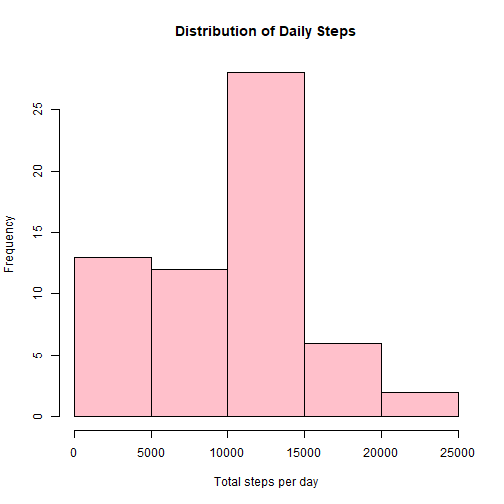
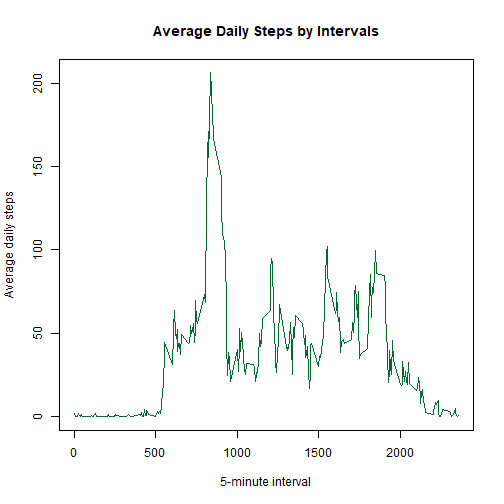
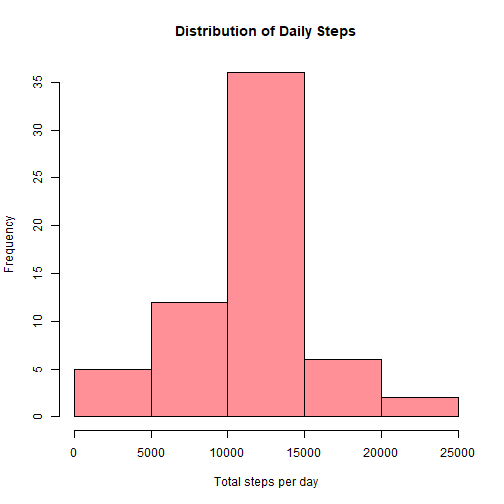
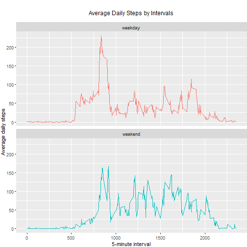

## **1. Setting up**

### 1-1. reading the file


```r
activity <- read.csv(unzip('activity.zip'))
```

### 1-2. Converting the date to a date variable


```r
library(lubridate)
```

```
## 
## Attaching package: 'lubridate'
```

```
## The following object is masked from 'package:base':
## 
##     date
```

```r
activity$date <- ymd(activity$date)
```

## **2. Summarising the data**

### 2-1 Mean Total Number of Steps Taken per Day


```r
daily_steps <- tapply(activity$steps, activity$date, sum, na.rm=TRUE)
hist(daily_steps, breaks=5, xlab='Total steps per day', main='Distribution of Daily Steps', col=colorRampPalette(c('red','pink'))(4)[4])
```



```r
avg = mean(daily_steps)
med = median(daily_steps)
```
On average, the person walked 9354.2295082 steps in total every day over October and November in 2012; and the median value of total steps is 10395


### 2-2 Average Daily Activity Pattern


```r
library(dplyr)
```

```
## 
## Attaching package: 'dplyr'
```

```
## The following objects are masked from 'package:lubridate':
## 
##     intersect, setdiff, union
```

```
## The following objects are masked from 'package:stats':
## 
##     filter, lag
```

```
## The following objects are masked from 'package:base':
## 
##     intersect, setdiff, setequal, union
```

```r
library(RColorBrewer)
pattern <- activity %>% group_by(interval) %>% summarize(avg=mean(steps, na.rm=TRUE))
plot(pattern$interval, pattern$avg, type='l', col=brewer.pal(5,'Greens')[5], xlab='5-minute interval', ylab='Average daily steps', main='Average Daily Steps by Intervals')
```



```r
pattern[which.max(pattern$avg), ]
```

```
## # A tibble: 1 x 2
##   interval   avg
##      <int> <dbl>
## 1      835  206.
```
On average, the interval of 8:35-8:40 has the highest number of steps over the period 10-01 to 11-30 in 2012.

### 2-3 Imputing Missing Values


```r
missing = sum(rowSums(is.na(activity)))
```
There are 2304 cases with missing values.
To impute the missing values, the mean value of average daily steps per 5-minute interval is adopted.


```r
miss <- activity[is.na(activity$steps), ]
miss_imputed <- merge(miss, pattern, by='interval', all.x=TRUE)
miss_imputed$steps <- miss_imputed$avg
activity2 <- rbind(activity[!is.na(activity$steps), ], miss_imputed[,1:3])
daily_steps2 <- tapply(activity2$steps, activity2$date, sum)
hist(daily_steps2, breaks=5, xlab='Total steps per day', main='Distribution of Daily Steps', col=colorRampPalette(c('red','pink'))(5)[4])
```



```r
avg2 = mean(daily_steps2)
med2 = median(daily_steps2)
```
As is shown in the plot, the total daily steps now seem more normally distributed, with the mean value 1.0766189 &times; 10<sup>4</sup> and the median 1.0766189 &times; 10<sup>4</sup>. Both values have increased compared to the first assignment.


### 2-4 Comparison of Activity Patterns between Weekdays and Weekends
*The plot including both weekdays and weekends is shown below:

```r
library(ggplot2)
activity2$day <- factor(wday(activity2$date)==1 |wday(activity2$date) ==7, labels=c('weekday', 'weekend'))
pattern2 <- activity2 %>% group_by(day, interval) %>% summarize(avg=mean(steps))
g <- ggplot(pattern2, aes(interval, avg))
g + geom_line(aes(col=day)) + facet_wrap(day~., nrow=2, ncol=1) + labs(x='5-minute interval', y='Average daily steps', title='Average Daily Steps by Intervals') +
  theme(plot.margin=margin(1,0,0,0,'cm'), plot.title=element_text(hjust=0.5,size=12,vjust=5), legend.position='none')
```




